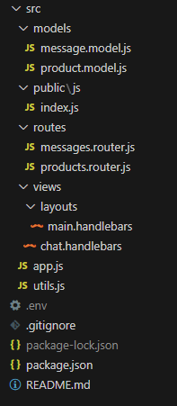

# Nombre del Proyecto

Breve descripción o resumen del proyecto.

## Contenidos

1. [Estructura](#estructura)
2. [Instalación](#instalación)
3. [Funcionalidades](#funcionalidades)
4. [Uso](#uso)
5. [API](#api)

## Estructura

La API esta estructurada de la siguiente manera:

    

## Instalación

1. Ejecute el comando `npm install` para instalar las dependencias necesarias.
2. Crear una base de datos en Atlas con el nombre "ecommerce" y luego configurar un archivo `.env` con la variable `MONGO_URL` con la dirección de la bd recien creada.
3. Ejecute el comando `npm start` para iniciar el servidor.

## Funcionalidades

La API consta de los modelos Products y Messages.

Con respecto al modelo `Products` la API puede mostrar, agregar, eliminar y editar un determinado producto usando mongoose a una base de datos montada en ATLAS (Servicio de bd proporcionado por MongoDB) a través de Postman.

El modelo `Messages` permite ingresar un mensaje de un determinado usuario y guardarlo en la Base de datos, luego va mostrando dentro de la web los mensajes y el usuario que envió dicho mensaje. Implementa algo parecido a un chat.

## Uso

**Productos**
- Utilizar Postman o cualquier otra herramienta que se utilice probar APIs.
- Para ver los productos en la base de datos mediante HTTP ingrese a [http://localhost:8080/api/products](http://localhost:8080/api/products)
- Para poder interactuar con los mensajes mediante web socket ingrese a [http://localhost:8080/api/messages](http://localhost:8080/api/messages)

## API

**Desde Postman**
- **GET**: `/` - Ruta para ver los productos por HTTP.
- **POST**: `/` - Ruta para ingresar un nuevo producto.
- **PUT**: `/:uid` - Ruta para actualizar un producto con un ID específico.
- **DELETE**: `/:uid` - Ruta para eliminar un producto con un ID específico. 

**Desde la web**
- **GET**: `/` - Ruta para ver los mensajes por WebSockets.
- **POST**: `/` - Ruta para ingresar un nuevo mensaje a través de Postman.